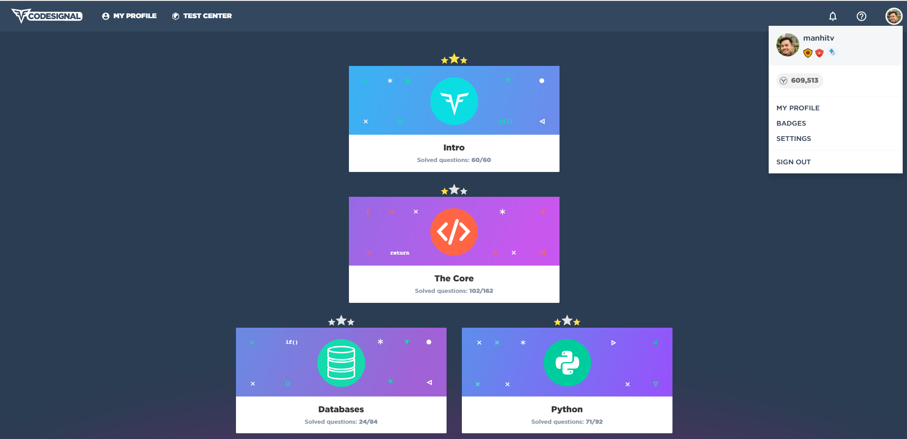
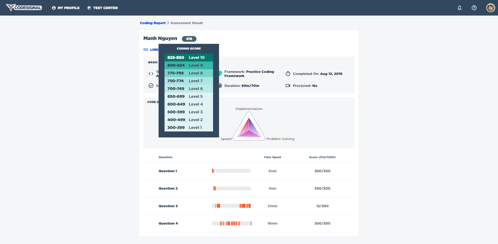

# CodeSignal

### This is the result of my 3 months of intensive training in Python programming (in 2019) with CodeSignal. 

- Level: **66/100**
- Arcade:
  - Intro: **60/60**
  - The core: **102/162**
  - Database: **24/84**
  - Python: **71/92**
- Coding Report Level: **9/10**
- Some Interview practice and Challenges 

To me, CodeSignal (formerly CodeFights) is really helpful that contains many challenges for improving coding skill quickly.
